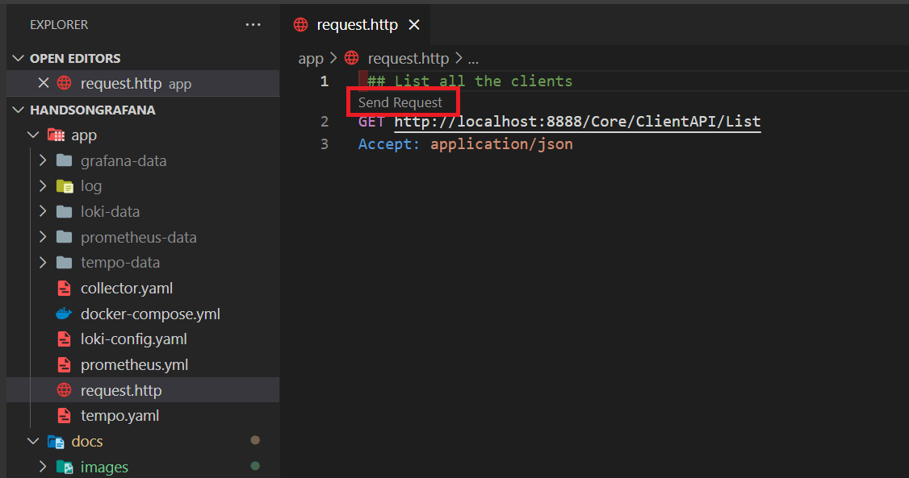
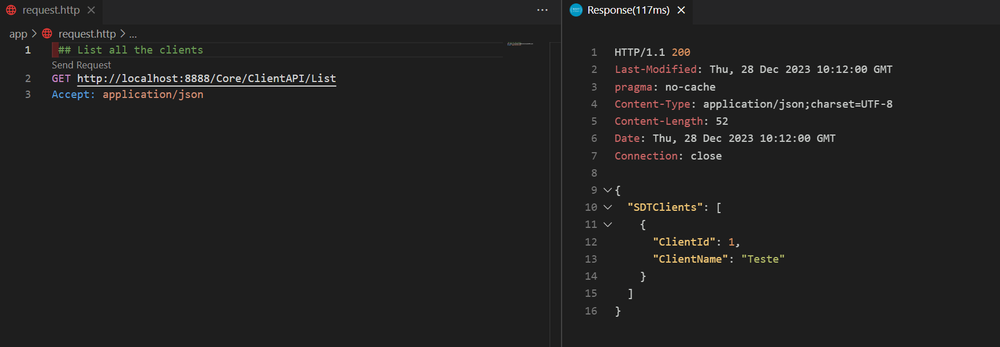
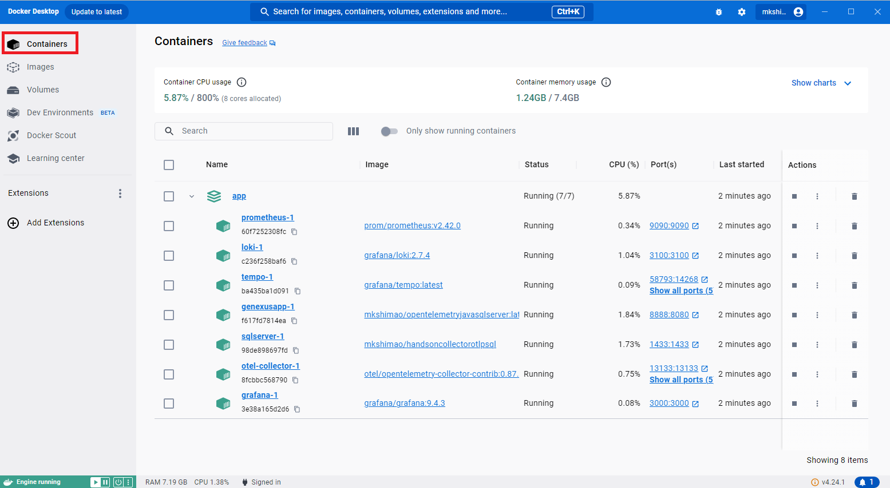

# Atividade 2

### Configurar os datasources do Grafana
Vamos executar uma aplicação Java com a observabilidade configurada, essa aplicação foi implantada numa imagem docker.
O coletor já está configurado para receber as métricas, logs e traces da aplicação e enviar para o Loki, Prometheus e Tempo.
Será utilizado o docker compose para subir os componentes da solução.

#### Passo 1
Abrir um linha de comando e ir até a pasta app, e executar o comando docker

```bash
docker-compose up -d
```


**Observação 1** - A primeira execução pode demorar, se as imagens não foram baixadas anteriormente.

**Observação 2** - Quando todos os conteineres estiverem no estado "Started", esperar uns 90 segundos até que o script SQL seja executado para criar a base de dados de exemplo.

#### Passo 2
Executar o request a API de teste para confirmar que a aplicação está respondendo, para isso abrir o arquivo request.http da pasta app com o VSCode.

Para executar o request clicar no texto "Send Request".

Esse request pode ser executado no Postman se preferirem.



A resposta deverá trazer um registro como na imagem.



Se o request não funcionar, existe a possibilidade de verificar no Docker Desktop se a aplicação está sendo executada de modo correto.



#### Passo 3

Logar no Grafana

#### Passo 4

Logar criar o datasource do Loki

#### Passo 5

Logar criar o datasource do Prometheus


#### Passo 6

Logar criar o datasource do Tempo

#### Passo 7

Explorar o log.

#### Passo 8

Explorar os traces.

#### Passo 9

Explorar as métricas.

Próxima atividade: [Atividade 03](03-atividade.md)


